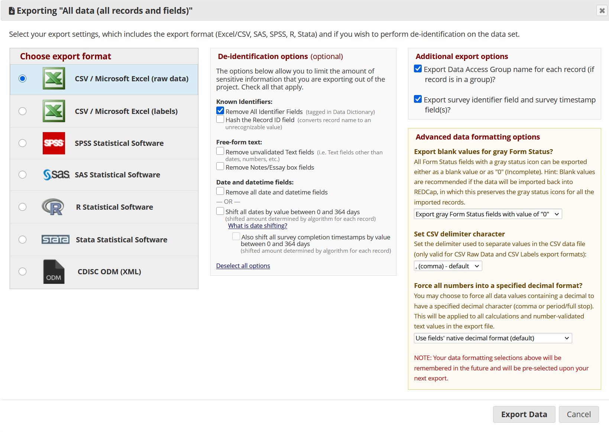

## Software specific guidelines for data and data dictionary/metadata format

This document provides software-specific best-practice guidance and code samples for exporting research data and accompanying data dictionaries from analytic or data-collection platforms such as **REDCap**, **SPSS**, **SAS**, and **Stata**. The goal is to simplify data preparation for NSRR ingestion for data contributors who currently use these platforms, and ensures compliance with the NSRR data and metadata standards. The sample code snippets included here are intended as reference templates to illustrate recommended steps and syntax. Users should review and adapt the examples according to their local environment, file paths, and software version. Because interface options and command syntax can vary across versions, always validate the export results and document any modifications or assumptions made when implementing these procedures.

### REDCap {#redcap}

1. Data files can be exported in formats such as `.csv`, and `.RData`. For longitudinal datasets, we recommend data to be exported in long format (one row per subject per event).
  a. Recommended settings for manual GUI export
  
| Option                           | Recommendation        |
|----------------------------------|-----------------------|
| Export format                    | CSV / Microsoft Excal (raw data)          |
| De-identification options        | Remove All Identifier Fields              |
| Set CSV delimiter character      | comma                                     |


  
  b. Export data via the REDCap API
  
```
# sample code for exporting REDCap data in R

install.packages("REDCapR")

library(REDCapR)

# Define API endpoint and token
api_url   <- "https://redcap.myinstitution.edu/api/"
api_token <- "XXXXXXYOURTOKENHEREXXXXXX"

# 1. Export data (records)
records <- redcap_read(
  redcap_uri = api_url,
  token = api_token,
  raw_or_label = "raw"     # export codes (raw values)
)$data

# 2. Export metadata (data dictionary)
metadata <- redcap_metadata_read(
  redcap_uri = api_url,
  token = api_token
)$data

# 3. Save locally
write.csv(records,  "data/project_data.csv",  row.names = FALSE)
write.csv(metadata, "metadata/data_dictionary.csv", row.names = FALSE)
```

2. Export the REDCap data dictionary in a flat `.csv` file with one row per variable (i.e., field). For longitudinal datasets, events metadata should also be exported (e.g., event-instrument mapping). Key columns from the data dictionary includes:

| Column                                       | Description                                              |
| -------------------------------------------- | -------------------------------------------------------- |
| `field_name`                                 | Variable name used in exports                            |
| `form_name`                                  | Instrument/form where field appears                      |
| `field_type`                                 | Text, radio, dropdown, checkbox, calc, descriptive, etc. |
| `field_label`                                | Human-readable question text                             |
| `select_choices_or_calculations`             | Encoded value and label pairs, or formula                |
| `field_note`                                 | Additional instructions                                  |
| `branching_logic`                            | Conditions for display                                   |
| `required_field`                             | y/n                                                      |

3. Extract the variable label pair (`select_choices_or_calculations` column in the data dictionary) into a seperate `.csv` file. (This step can be done at NSRR.)

```
# Sample R code
library(tidyr)
library(dplyr)
library(stringr)

value_labels <- metadata %>%
  filter(field_type %in% c("radio", "dropdown", "checkbox")) %>%
  select(field_name, select_choices_or_calculations) %>%
  mutate(
    choice_pairs = str_split(select_choices_or_calculations, "\\s*\\|\\s*")
  ) %>%
  unnest(choice_pairs) %>%
  separate(choice_pairs, into = c("value", "label"), sep = ",\\s*", extra = "merge") %>%
  mutate(value = trimws(value), label = trimws(label))

write.csv(value_labels, "metadata/value_labels_long.csv", row.names = FALSE)
```

### SPSS {#spss}
1. Data files can be exported in `.csv` (preferred) or `.xlsx` format  
  a. Keep the variable names in the header and numeric values (not labels) in the cells	
  b. Keep missing values consistent and document them in the data dictionary

```
SAVE TRANSLATE
/OUTFILE='data\dataset_nsrr.csv'
/TYPE=CSV
/REPLACE
/FIELDNAMES
/CELLS=VALUES
/MAP.
```
  
2. Data dictionary (variable metadata)
  a. Use `DISPLAY DICTIONARY.` to print all metadata to the output view, then save it as a .csv and submit with the data files.

```
OMS
/SELECT TABLES
/IF COMMANDS=['DISPLAY DICTIONARY'] SUBTYPES=['Variables']
/DESTINATION FORMAT=CSV OUTFILE='metadata\variable_dictionary.csv'
/TAG='DICT_VARS'.
DISPLAY DICTIONARY.
OMSEND TAG=['DICT_VARS'].
```

3. Code book (variable label table)
  a. Create a long format reference table of coded values for categorical variables (e.g., 1=Female, 2=Male, etc.)
  
```
OMS
/SELECT TABLES
/IF COMMANDS=['DISPLAY DICTIONARY'] SUBTYPES=['Value Labels']
/DESTINATION FORMAT=CSV OUTFILE='metadata\value_labels_long.csv'
/TAG='DICT_VALS'.
DISPLAY DICTIONARY.
OMSEND TAG=['DICT_VALS'].
```

### SAS

1.	Data files can be exported in .sas7bdat, .csv, .xlsx format
  a. If exported in `.csv` format, keep the variable names in the header and numeric values (not labels) in the cells.
  b. Keep missing values consistent and document them in the data dictionary
2.	NSRR recommends the data dictionaries and value labels to be extracted and to be saved as another table (`.csv`)
  a. Extract data dictionary (`PROC CONTENTS`)

```
libname mydata 'C:\project\data';

/* Create a dataset of variable metadata */
proc contents data=mydata.studydata out=mydata.dictionary_raw noprint;
run;

/* Select key fields and export to CSV */
data mydata.dictionary_clean;
  set mydata.dictionary_raw(keep=name label type length format informat varnum);
run;

proc export data=mydata.dictionary_clean
    outfile="C:\project\metadata\data_dictionary.csv"
    dbms=csv replace;
    putnames=yes;
run;
```
  b. Extract value labels from `FORMAT catalogs` via `PROC FORMAT`.

```
/* Export all user-defined formats */
proc format cntlout=mydata.format_catalog;
run;

/* Save as CSV for documentation */
proc export data=mydata.format_catalog
    outfile="C:\project\metadata\value_labels.csv"
    dbms=csv replace;
    putnames=yes;
run;
```

### STATA

1. Data files are recommended to be exported in the `.csv` format

```
* Change these paths:
local root   "C:/project"
local data   "`root'/data"
local meta   "`root'/metadata"
cap mkdir "`root'"
cap mkdir "`data'"
cap mkdir "`meta'"

* Assume your dataset is already in memory, or open it:
use "`data'/studydata.dta", clear

* CSV for analysis: numeric codes (no value-label expansion)
export delimited using "`data'/studydata_clean.csv", ///
    replace varnames(1) nolabel quote always encoding(utf-8)
```

2. Data dictionaries need to be extracted and saved as a seperate `.csv` files

```
* In the variable-level data dictionary (one row per variable) will contain:
* name, varlabel, type, format, vallab (value-label name), strlen
frame drop _all
frame create dict str64 variable_name str244 variable_label ///
                   str16 storage_type str24 display_format ///
                   str64 value_label_name int var_order


* Build dictionary by looping vars in order
local order = 0
frame change dict
frame change default
ds
foreach v of varlist `r(varlist)' {
    local ++order
    local vlab   : variable label `v'
    local stype  : type `v'
    local dform  : format `v'
    local vlnm   : value label `v'
    if "`vlnm'"=="" local vlnm = ""
    frame post dict (`"`v'"' , `"`vlab'"' , `"`stype'"' , `"`dform'"' , `"`vlnm'"' , `order')
}

frame change dict
sort var_order
export delimited using "`meta'/variable_dictionary.csv", replace quote always encoding(utf-8)
```
3. Extract value-label pairs as a long table and export as a `.csv` file

```
* Dependencies
ssc install labelsave //run once

# Edit paths
clear all
set more off
unicode encoding set "utf-8"
local root  "C:/project"
local meta  "`root'/metadata"
cap mkdir "`meta'"

* 1) Save all value-label definitions to a do-file (provenance)
labelsave, saving("`meta'/value_labels_do.do") replace

* 2) Parse that do-file into a long dataset of (format, value, label)
tempname fh
tempfile lbltxt outdta

* Normalize line endings to LF to make reading line-by-line stable
filefilter "`meta'/value_labels_do.do" "`lbltxt'", from("\r") to("\n") replace

* Collector (store value as string to cover numeric and string codes)
capture postutil clear
postfile H str64 value_label_name str244 value str244 value_label using "`outdta'", replace

file open `fh' using "`lbltxt'", read text

* Prime the first read (so r(eof) is defined)
file read `fh' line
while (r(eof)==0) {
    local L = trim(`"`line'"')

    * Match:  label define FMT <code> "<text>" [<code> "<text>"]..., [modify|add]
    if substr("`L'",1,12)=="label define" {
        tokenize "`L'", quotes
        local fmt = "`3'"

        * Remove leading prefix once, drop trailing options
        local prefix = "label define `fmt'"
        local tail   = trim(subinstr("`L'", "`prefix'", "", 1))
        local tail   = regexr("`tail'", ",[ ]*(modify|add)$", "")
        local tail   = trim("`tail'")

        * Tokenize tail with quotes preserved
        tokenize "`tail'", quotes
        local i = 1
        while "``i''" != "" {
            local tok = "``i''"

            * --- CASE A: string-valued code (token itself is quoted) ---
            if substr("`tok'",1,1)==`"""' & substr("`tok'",-1,1)==`"""' {
                * code is the quoted token
                local code = substr(`"`tok'"', 2, strlen(`"`tok'"')-2)
                local ++i
                local lbltok = "``i''"
                if substr("`lbltok'",1,1)==`"""' & substr("`lbltok'",-1,1)==`"""' {
                    * strip outer quotes
                    local lab = substr(`"`lbltok'"', 2, strlen(`"`lbltok'"')-2)
                    * unescape doubled quotes inside label -> "
                    local lab = subinstr("`lab'", char(34)+char(34), char(34), .)
                    post H ("`fmt'") ("`code'") ("`lab'")
                }
                local ++i
                continue
            }

            * --- CASE B: numeric code (possibly negative/decimal) ---
            if regexm("`tok'", "^-?[0-9]+(\.[0-9]+)?$") {
                local code = "`tok'"
                local ++i
                local lbltok = "``i''"
                if substr("`lbltok'",1,1)==`"""' & substr("`lbltok'",-1,1)==`"""' {
                    local lab = substr(`"`lbltok'"', 2, strlen(`"`lbltok'"')-2)
                    local lab = subinstr("`lab'", char(34)+char(34), char(34), .)
                    post H ("`fmt'") ("`code'") ("`lab'")
                }
                local ++i
                continue
            }

            * Otherwise, skip token (handles stray commas/options safely)
            local ++i
        }
    }

    file read `fh' line
}
file close `fh'
postclose H

use "`outdta'", clear
order value_label_name value value_label
sort  value_label_name value

* 3) Export as CSV (UTF-8)
export delimited using "`meta'/value_labels_long.csv", replace ///
    quote always encoding(utf-8)

display as result "Wrote: `meta'/value_labels_long.csv"
```
